# PyMentor — Le tuteur de code qui ne donne jamais la solution

> **Vision :** les élèves tunisiens apprennent Python **en faisant**, avec un tuteur IA qui guide pas à pas mais **ne révèle jamais la réponse**. Faire réfléchir l'élève plus que le tuteur ne parle.

[](#-sous-le-capot-technique)
[%20%7C%20English-green)](#-sous-le-capot-technique)
[](#-sous-le-capot-technique)
[](https://mypymentor.vercel.app)

**Démo en ligne : https://mypymentor.vercel.app** — rejoignez un exercice avec un code `PY-XXXX`, ou créez-en un en 2 minutes.

---

## Pourquoi PyMentor ?

En classe de BAC Informatique, le même scénario se répète : un élève bloque sur une boucle, ouvre ChatGPT, **copie la solution sans la comprendre**, et échoue le jour de l'examen. Pendant ce temps, l'enseignant — seul face à 30 élèves — ne peut pas aider chacun individuellement, ni savoir qui a vraiment compris.

**PyMentor renverse la logique :** l'IA ne donne plus la réponse, elle **pose des questions, révèle des indices progressifs et célèbre chaque étape réussie**. L'élève construit la solution lui-même, ligne par ligne. Et l'enseignant suit la progression de toute la classe **en temps réel**, sans corriger une seule copie.

---

## La solution en 30 secondes

| Étape | Qui | Quoi |
|-------|-----|------|
| 1️⃣ | **Enseignant** | Crée un exercice (manuel, assisté par IA, ou import) → le publie → écrit le code `PY-XXXX` au tableau |
| 2️⃣ | **Élève** | Va sur `/student/join`, entre le code + son prénom — **pas de compte, pas de mot de passe** |
| 3️⃣ | **Élève** | Code dans l'éditeur, exécute en vrai Python, reçoit des **indices en 5 niveaux** (jamais la solution) |
| 4️⃣ | **Enseignant** | Voit qui est bloqué, qui a terminé, combien d'indices chacun a utilisés |

---

## Côté élève : coder, se tromper, comprendre

### Rejoindre en 10 secondes

Pas d'inscription, pas d'email : un code affiché au tableau et un prénom. Sur le même appareil, l'élève reprend automatiquement sa session.

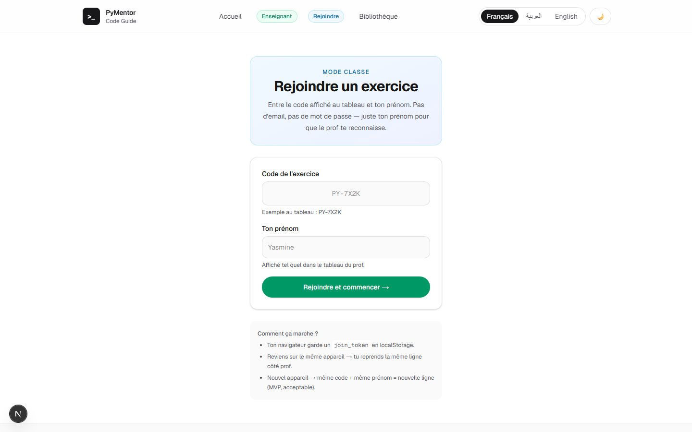

### Un vrai IDE dans le navigateur

Éditeur avec coloration Python, console, zone `stdin`, bouton **Exécuter** et bouton **Arrêter** (les boucles infinies ne bloquent jamais la page). Python tourne **dans le navigateur** via Pyodide (WebAssembly) : aucune latence serveur, et ça fonctionne **hors-ligne** une fois chargé.

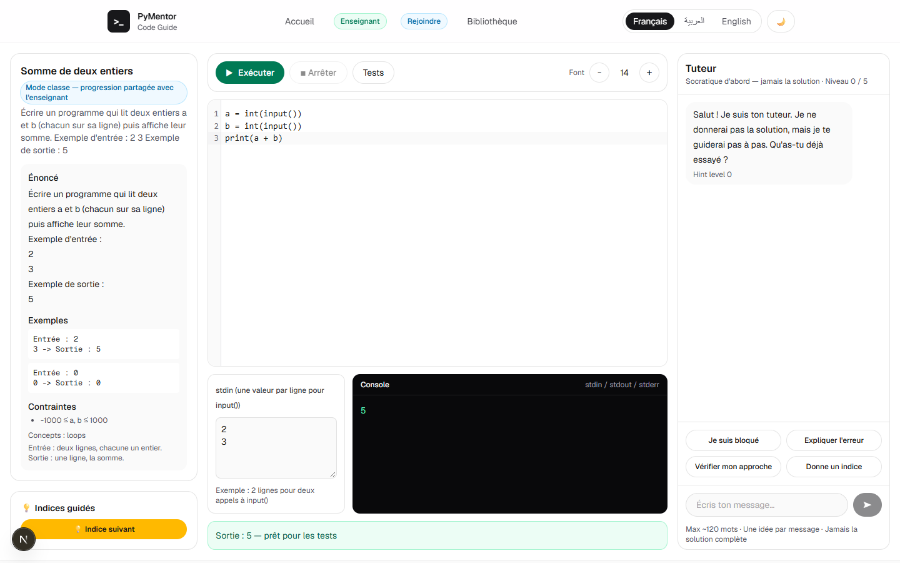

### L'énoncé, toujours sous les yeux

Énoncé, exemples d'entrée/sortie, contraintes et concepts — avec un badge « Mode classe » quand la progression est partagée avec l'enseignant.

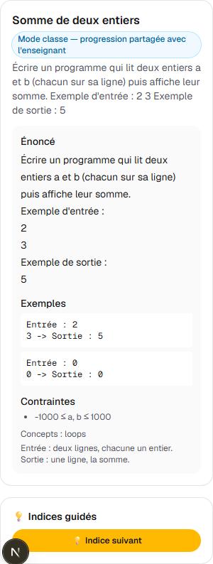

### Un tuteur socratique, pas un distributeur de réponses

Le tuteur pose d'abord une question, explique les erreurs en langage simple, décrit les symptômes sans donner le remède (« ta sortie oublie le dernier élément »). Messages courts, ton encourageant, **jamais condescendant**. Disponible en français, arabe et anglais.

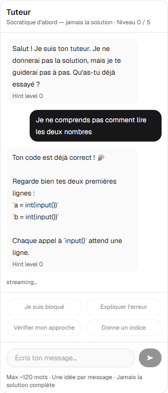

### Des indices en 5 niveaux — la signature PyMentor

Quand l'élève clique **💡 Indice suivant**, le système révèle progressivement la solution **en commentaire dans son propre code** : question d'abord, ligne complète en tout dernier recours. Le niveau n'augmente que si l'élève a **modifié son code et exécuté** depuis le dernier indice — l'effort est récompensé, pas le clic frénétique.

| Niveau | Ce que l'élève voit |
|--------|---------------------|
| 1 💬 | Une question (« Que doit-on lire en premier ? ») |
| 2 🎯 | La cible : variable, boucle, condition… |
| 3 ⚙️ | La fonction ou l'opérateur à utiliser |
| 4 🧩 | La ligne partiellement masquée (`n = int(▮▮▮())`) |
| 5 ✅ | La ligne complète (plafond absolu) |

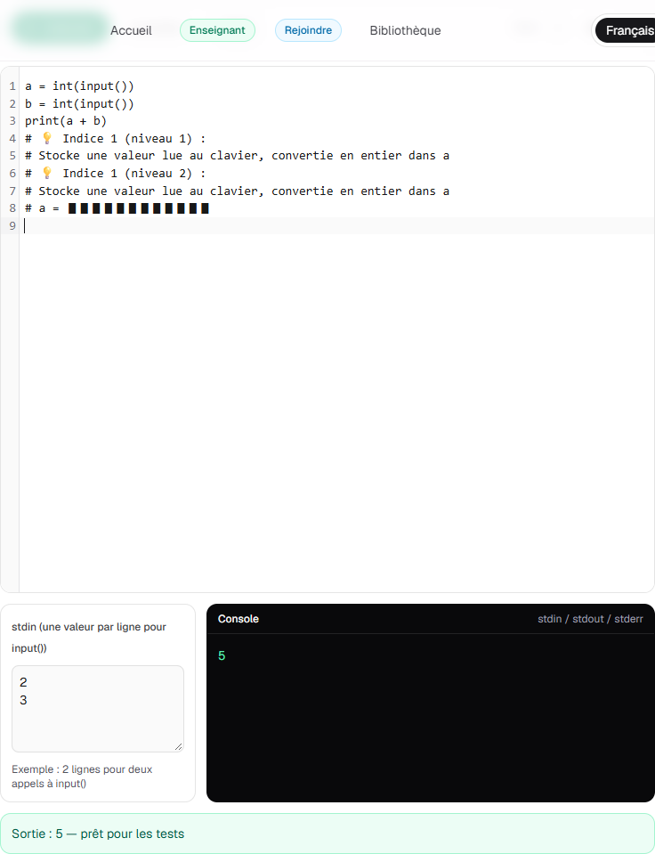

### Aussi à l'aise sur téléphone

Trois onglets (Exercice / Éditeur-Console / Tuteur), éditeur tactile, interface traduite et **RTL complet en arabe**. Pensé pour les élèves qui n'ont qu'un smartphone.

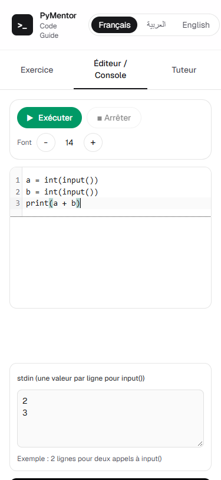

---

## Côté enseignant : 2 minutes pour un exercice, zéro correction

### Connexion sans mot de passe

Un email → un **lien magique** valable 15 minutes. Pas de SSO institutionnel à négocier avec l'administration, pas de mots de passe à réinitialiser.

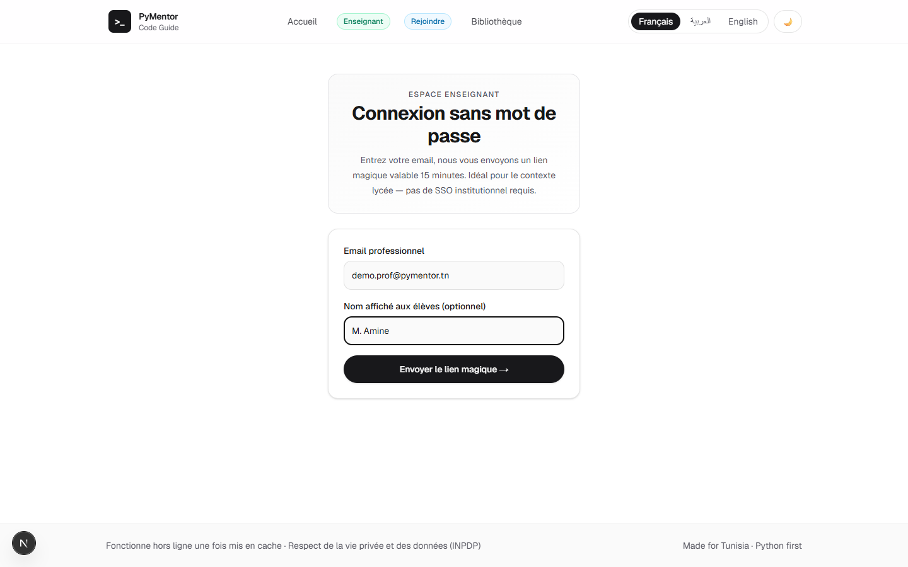

### Tableau de bord : qui a compris, d'un coup d'œil

Chaque exercice affiche son code `PY-XXXX`, sa visibilité (classe ou bibliothèque publique) et son **badge de vérification honnête** : ✓ vérifié (exécution réelle), ✓ vérifié (IA — à confirmer), ou ⚠ à vérifier.

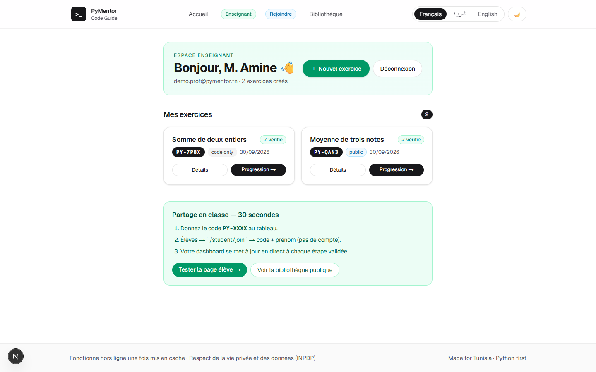

### Créer un exercice en 3 modes

- **Manuel** : titre, énoncé, exemples, correction — les indices sont auto-générés.
- **Assisté par IA** : collez un énoncé brut, l'IA le structure et propose une solution commentée.
- **Import** : déposez un bundle `exercise.md` + `reference.py` (20 exercices BAC déjà prêts dans `exercices/`).

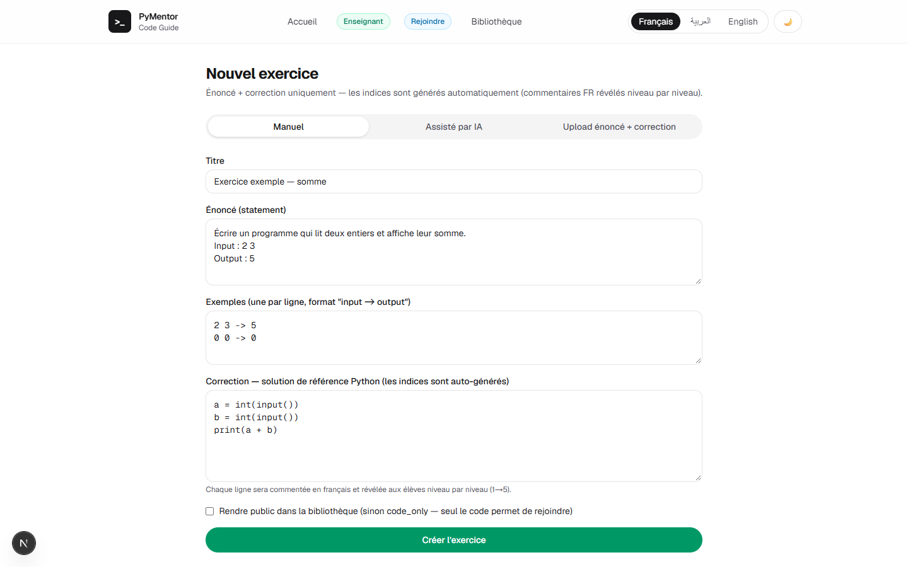

### Publier = vérifier + générer les indices

À la publication, le système **exécute réellement la correction** contre les exemples (chaîne local → Wandbox distant → dry-run IA, voir § Technique), génère les **commentaires pédagogiques français** qui serviront aux 5 niveaux d'indices, et attribue le badge de vérification. L'enseignant peut prévisualiser la version commentée et tester le parcours élève en un clic (« Aperçu élève »).

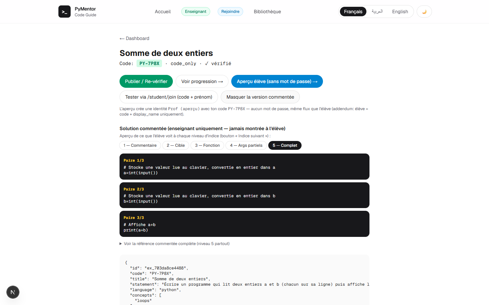

### Progression de la classe en direct

Prénom, indices révélés, statut (en cours / terminé), dernière activité, nombre de sessions — et le taux de complétion global. De quoi repérer **qui est bloqué et où**, pendant le TP, pas après.

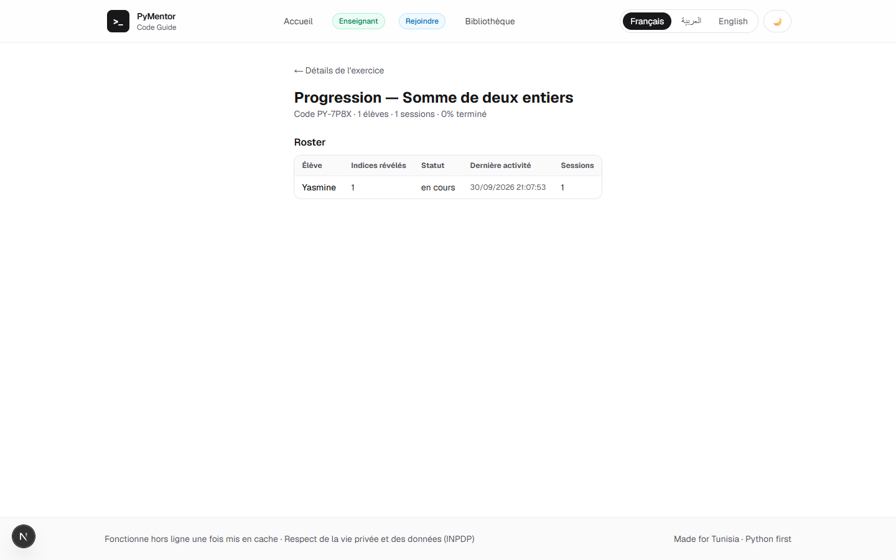

### Bibliothèque publique

Les exercices marqués `public_library` sont mutualisés entre enseignants : un bien commun pédagogique qui grandit à chaque publication.

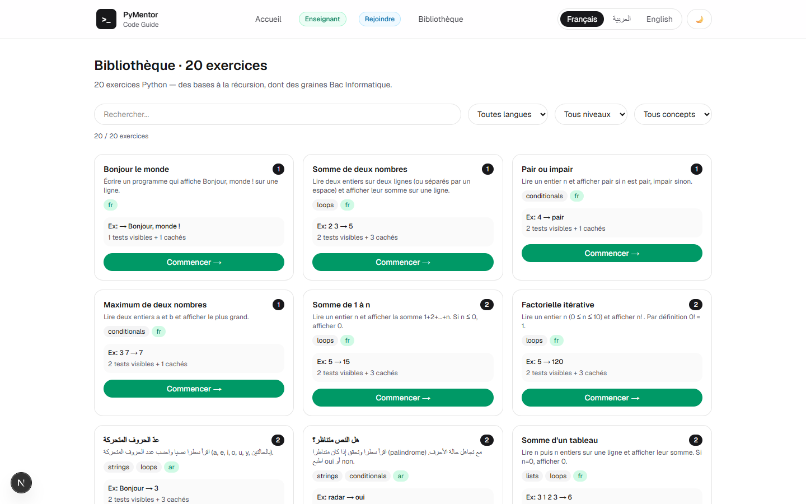

---

## La pédagogie en 5 principes

1. **Jamais la solution.** Ni au début, ni sur demande, ni après 10 échecs. Le plafond d'aide est une ligne commentée — le corps du programme reste à écrire. (`src/lib/tutor/antiLeak.ts`, `commentHints.ts`)
2. **Socratique d'abord.** Une question avant un indice, un indice avant un exemple. (`hintCards.ts` — 23 cartes de questionnement)
3. **Effort récompensé.** Le niveau d'indice n'augmente qu'après modification du code **et** exécution. On aide ceux qui essaient.
4. **Erreur = leçon.** Chaque type d'erreur Python est expliqué en langage simple, avec la ligne fautive pointée — jamais réécrite à la place de l'élève.
5. **L'enseignant garde la main.** C'est lui qui choisit les exercices, voit les efforts, valide les acquis. L'IA assiste, elle ne remplace pas.

---

## Conformité au programme officiel tunisien

Tous les contenus sont alignés sur le **BAC Informatique (référentiel 2022/2023)** — voir `bac_informatique_python_reference_guide.md`.

**Autorisé et suggéré :** `input()`/`print()`, `int`/`float`/`bool`/`str`, tableaux `numpy.array`, dictionnaires, `if`/`elif`/`else`, `for`/`while` (sans `break`), une seule fonction `def`, opérateurs arithmétiques et logiques.

**Jamais suggéré :** `break`, `map`/`split`/`strip`, `max`/`min`/`sum`/`sorted`, `**`, f-strings, ternaires, tuples — tout ce qui est hors-programme est filtré par le générateur de solutions et de squelettes (`reference.ts`, `skeleton.ts`).

---

## Sous le capot (technique)

| Couche | Choix | Pourquoi |
|--------|-------|----------|
| Frontend | Next.js 16 + React 19 + TypeScript strict | SSR rapide, PWA, un seul déploiement |
| Éditeur | CodeMirror 6 | Léger, tactile, coloration Python |
| Exécution élève | **Pyodide 0.26 dans un Web Worker** | Zéro serveur, hors-ligne, timeout 5 s + bouton Stop |
| Backend | Routes API Next.js (Node) | Clés IA jamais exposées au navigateur |
| Base | **Supabase Postgres** (RLS, service_role) + repli mémoire | Persistance exercices + progression |
| IA | Groq → Gemini → Anthropic (cascade) | Rapidité d'abord, qualité en repli |
| i18n | fr / ar (RTL) / en | La langue de l'élève, pas celle du logiciel |
| Tests | **Vitest — 333 tests**, budget 230 Ko gz | `npm run lint && npm run typecheck && npm test && npm run build` |

### Vérifier une correction sans Python sur le serveur ? Chaîne en 3 niveaux

Vercel serverless n'embarque pas d'interpréteur Python. La publication utilise donc une chaîne à dégradation gracieuse (**code du professeur uniquement — jamais de code d'élève**) :

1. **`local`** — `python` présent (dev, VPS) : exécution réelle.
2. **`remote`** — API publique [Wandbox](https://wandbox.org) (gratuite, sans clé) : exemples en parallèle. Sautée si `numpy`/`pandas` (absents des sandboxes gratuites).
3. **`llm_dryrun`** — le LLM « exécute mentalement » la référence et prédit les sorties ; **le serveur compare lui-même** (le modèle ne rend jamais le verdict).

En dernier recours : message honnête + `reference_verified:false` — la correction du professeur n'est **jamais accusée à tort**. La méthode est persistée (`verification_method`, migration `0002`) et affichée en badge. Détails : `src/lib/exercise/remotePython.ts`, `dryRun.ts`, route `publish`.

### Sécurité, éthique, données

- **Anti-fuite multicouche** : la solution de référence ne quitte jamais le serveur ; filtre de sortie (blocs > 6 lignes refusés), test « would-pass », contrôle de similarité.
- **Données minimales** : élèves anonymes (prénom + token), pas de compte, pas d'email ; RLS sans politiques (refus par défaut, seul le serveur accède) ; conforme loi tunisienne **INPDP**.
- **Injection de prompt** : énoncés et code élève traités comme des données, jamais des instructions.
- **Rate limiting** : 15 req/min (tuteur), 10 req/min (upload) ; taille des messages plafonnée.

---

## Démarrage rapide

```bash
npm install
cp .env.example .env.local   # clés IA + Supabase (optionnel : tout marche en dégradé)
npm run dev                  # http://localhost:3000
```

```bash
npm run lint && npm run typecheck && npm test && npm run build
node scripts/check-budget.mjs            # budget initial < 230 Ko gz
node scripts/screenshots.mjs             # régénère docs/screenshots/ (dev server requis)
```

**Sans aucune clé**, tout fonctionne en mode dégradé : parsing heuristique, indices locaux, exécution Pyodide.

### Déploiement

```bash
vercel --prod   # production actuelle : https://mypymentor.vercel.app
```

Variables : `GROQ_API_KEY`, `GEMINI_API_KEY`, `ANTHROPIC_API_KEY`, `TEACHER_AUTH_SECRET`, `SUPABASE_URL`, `SUPABASE_SERVICE_ROLE_KEY` (+ `REMOTE_EXEC`, `WANDBOX_URL` — voir `.env.example`). Migrations : `supabase/migrations/0001_init.sql` puis `0002_verification_method.sql`.

---

## Dossier concours — où voir chaque critère

| # | Critère | Preuve dans PyMentor |
|---|---------|----------------------|
| 1a | Objectifs clairs | Chaque exercice = titre + énoncé + exemples + concepts + difficulté (§ Parcours élève) |
| 1b | Scénarisation | Parcours join → code → run → indices → tests → complétion ; mode classe 30 s (§ Solution en 30 s) |
| 1c | Stratégies | Socratique d'abord, 5 niveaux d'indices, effort récompensé, erreur expliquée (§ Pédagogie) |
| 1d | Évaluation | Tests visibles/cachés, progression par élève, taux de complétion (`11-teacher-progress.png`) |
| 2a | Programme officiel | Référentiel BAC 2022/2023, filtre hors-programme (§ Conformité) |
| 2b | Qualité linguistique | UI fr/ar/en, commentaires FR auto-générés, messages ≤ 120 mots |
| 3a | Stabilité | 333 tests, TypeScript strict, dégradation gracieuse documentée |
| 3b | Multi-supports | Desktop 3 panneaux + mobile onglets + PWA hors-ligne (`13-mobile-workspace.png`) |
| 3c | Efficience techno | Pyodide local (0 serveur), budget 230 Ko, cascade LLM économe |
| 3d | Ergonomie | Join sans compte, lien magique, badges, aperçu élève, 13 captures ci-dessus |
| 3e | Accessibilité | Clavier navigable, labels ARIA, RTL arabe, taille de police réglable, contraste |
| 4a | Pertinence techno | WASM pour l'exécution (coût nul), serverless pour l'échelle, Postgres pour la persistance |
| 4b | Intégration réelle | L'IA structure, commente, questionne, vérifie — jamais un gadget plaqué |
| 4c | Complexité maîtrisée | Chaîne de vérification 3 niveaux, anti-leak multicouche, auth HMAC stateless |
| 5a | Innovation péda | Indices-commentaires en 5 niveaux avec masquage `▮` (`06-hints.png`) |
| 5b | Innovation techno | Dry-run LLM avec comparaison serveur, squelettes anti-fuite BAC |
| 6a | Expérimentation | Tableau de progression temps réel prêt pour protocole classe (roster, sessions) |
| 6b | Mesure d'impact | Indices/élève, tentatives, complétion — exportables pour analyse |
| 7 | Données & éthique | Anonymat élèves, RLS, INPDP, anti-fuite, rate-limit (§ Sécurité) |
| 8a | Code exploitable | Ce dépôt : structure `src/`, 333 tests, `PROJECT_SPEC.md`, ADRs dans `docs/adr/` |
| 8b | Documentation | Ce README + `.env.example` + migrations SQL + script de captures rejouable |

---

## Feuille de route

- [x] IDE + Pyodide + indices 5 niveaux + tuteur socratique
- [x] Flux enseignant (création 3 modes, publication vérifiée, progression)
- [x] Auth sans mot de passe (lien magique) + persistance Supabase
- [x] Chaîne de vérification 3 niveaux + badges honnêtes
- [ ] Vérification serveur 100 % exécutée (hôte avec Python ou sandbox dédiée)
- [ ] Cartes d'indices en arabe et anglais (23 cartes FR aujourd'hui)
- [ ] Import des 20 exercices BAC en production
- [ ] Protocole d'expérimentation en classe + mesure d'impact (critère 6)

---

*PyMentor — apprendre Python en le faisant, avec un tuteur qui guide et ne donne jamais la solution. Fait pour la Tunisie, pensé pour la classe.*
